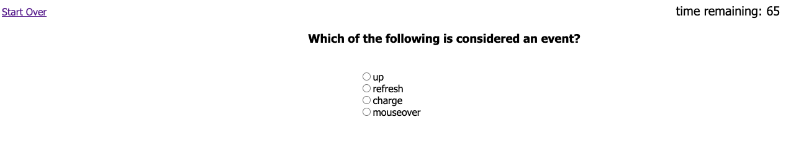

# JavaScript Quiz

## Description

For this week's challenge, I created a coding quiz that asks 10 multiple choice questions about JavaScript. You have 75 seconds to answer the questions, however you lose 10 seconds of time for each question you get wrong. If the time runs out, or if you answer all the questions, you will be presented with your final score, and be prompted to enter you initials to be entered into the high scores. Once you click submit (make sure you enter at least 1 character but no more than 3), you'll be taken to the list of high scores. If it is your first time, it should only have your initials. If at any point you would like to clear the high scores simply press the clear high scores button and they will be reset. To re-take the quiz, click on the link in the top left of the screen.

In this challenge I used a lot of what I learned this past module which includes event listeners, preventing default, adding attributes and creating elements via JavaScript, the setInterval method, local storage, and more! It was a good opportunity to put all of those together and create a interactive quiz.

## Usage

To access this JavaScript quiz, you can run it locally by using VScode's live server plugin. Right click on index file and select `Open with live server` 

Or

This website can be ran on Github Pages using the following link [JavaScript Quiz](https://brett-hicklin.github.io/javascript-quiz/)

Once the website has loaded in your preferred way, click on the "Start Quiz" button to start your quiz! Answer each question as best you can, and as quick as you can, as there is only 75 seconds allowed! If you run out of time before the last question is answered the game will end and your score will be logged. You get 1 point for each right question, and minus 10 seconds on the clock for each wrong question. Once you get to the end of the quiz by answer all the questions or having the time run out, you can then enter your initials to be added onto the high scores. Once you click submit, you will be taken the view the high scores, where you can see how you did. There is also a "clear high scores" button to reset the high score table. There is also a link in the top left of the screen to start the quiz over at any point

example screenshots are provided below: 

